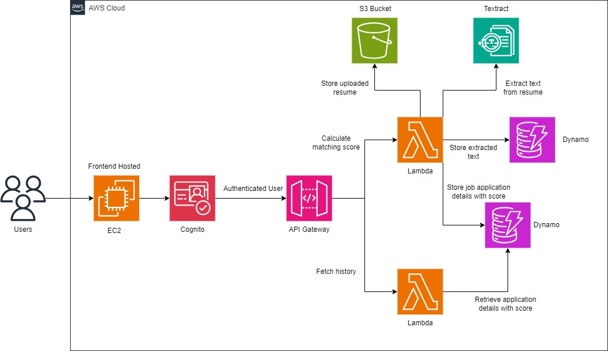

# Job Matching Application

## Overview

The Job Matching Application is a cloud-based system designed to assist job seekers in optimizing their resumes for better compatibility with Applicant Tracking Systems (ATS). It also streamlines the candidate matching process for recruiters by automating resume analysis and scoring.

The application compares the job seeker's resume with the provided job description and suggests missing keywords to enhance the resume's alignment with the job role. Additionally, users can track their application history and see whether their resume's score has improved, decreased, or remained the same compared to previous submissions for the same job posting.

## New Features

### For Job Seekers

- **Resume Keyword Suggestions**: After analyzing your resume, the system suggests missing keywords from the job description that could be included to improve your score. This allows job seekers to better tailor their resumes to specific roles.
- **Application History with Score Comparison**: The history tab now displays all your previous job applications, along with indicators (arrows) that show whether the matching score has improved or declined for the same job posting.

### For Recruiters

- **Candidate Matching**: Automatically calculates a matching score between job descriptions and resumes, helping recruiters quickly identify the best candidates.
- **Resume Storage and Processing**: Securely store and process resumes, with automated data extraction and matching.

## Architecture



The Job Matching Application is built using a variety of AWS services:

1. **Frontend Hosting**: The web application frontend is built using React+Vite and hosted using AWS services configured via CloudFormation.
2. **User Authentication**: Managed by Amazon Cognito, providing secure user sign-up, sign-in, and multi-factor authentication.
3. **API Management**: AWS API Gateway routes requests to the appropriate AWS Lambda functions.
4. **Resume Upload and Processing**: Resumes uploaded by users are stored in AWS S3, and AWS Lambda functions process these resumes using Amazon Textract for text extraction.
5. **Data Storage and Score Calculation**: Extracted resume data and job descriptions are stored in AWS DynamoDB. AWS Lambda functions calculate a matching score based on resume and job description comparisons.
6. **Application History**: AWS Lambda functions allow users to retrieve their application history, which now includes comparisons between current and previous scores for the same job role.

## Technology Stack

- **Frontend**: React+Vite (JavaScript), deployed using AWS services.
- **Backend**: AWS Lambda (Node.js), for serverless function execution.
- **Authentication**: Amazon Cognito for secure user management.
- **Database**: AWS DynamoDB for storing job application details and extracted resume data.
- **Storage**: AWS S3 for storing resume files.
- **API Management**: AWS API Gateway for routing requests.
- **Text Extraction**: Amazon Textract for extracting text from uploaded resumes.

## Setup and Deployment

### Prerequisites

1. **AWS Account**: Required to set up and run the CloudFormation stack.
2. **AWS CLI**: To interact with AWS services from your command line (optional if using AWS Management Console).

### Deployment Steps

1. **Clone the Repository**:

   ```bash
   git clone https://github.com/ChristinSaji/Job-Matching-App.git
   cd Job-Matching-App
   ```

2. **Upload Lambda Functions and CloudFormation Script**:

   - Upload the Lambda `.zip` files to an S3 bucket. Create a bucket or modify the CloudFormation script to match the bucket name you created.
   - Modify the CloudFormation script (`job-matching-cloudformation-stack.yaml`) to reference the correct S3 bucket for the Lambda function `.zip` files.

3. **IAM Role and Bucket Updates**:

   - Update the IAM roles in the CloudFormation script to ensure Lambda functions have the correct permissions for accessing S3, DynamoDB, and Textract.
   - Ensure the correct S3 bucket names are updated in the CloudFormation script:
     - Bucket for Lambda zip files.
     - Bucket for storing resume files.

4. **Deploy the CloudFormation Stack**:

   - Deploy the stack via AWS Management Console or AWS CLI:

     ```bash
     aws cloudformation create-stack --stack-name JobMatchingAppStack --template-body file://job-matching-cloudformation-stack.yaml --capabilities CAPABILITY_IAM
     ```

   - The CloudFormation stack will automatically provision all necessary AWS resources.

5. **Key Pair for EC2**:

   - If the stack provisions an EC2 instance, create a key pair named `ta-key` in the AWS Console before deployment.
   - Update the `KeyName` in the CloudFormation script to match the created key pair:
     ```yaml
     KeyName: "ta-key"
     ```

6. **Monitor Deployment**:

   - Use the AWS CloudFormation console to monitor the stack creation process and ensure all resources are created successfully.

7. **Update CloudFormation Stack**:

   - For changes, update the CloudFormation stack by uploading new Lambda `.zip` files and modifying the template. Then update the stack using AWS CLI:
     ```bash
     aws cloudformation update-stack --stack-name JobMatchingAppStack --template-body file://job-matching-cloudformation-stack.yaml --capabilities CAPABILITY_IAM
     ```

## Usage

- **Job Seekers**: Upload resumes, receive keyword suggestions to improve your resume, and view your application history with score comparisons.
- **Recruiters**: Upload job descriptions, view matched candidates, and manage the recruitment process more efficiently.

## Contributing

Contributions are welcome! Please open an issue or submit a pull request for any changes or improvements.
